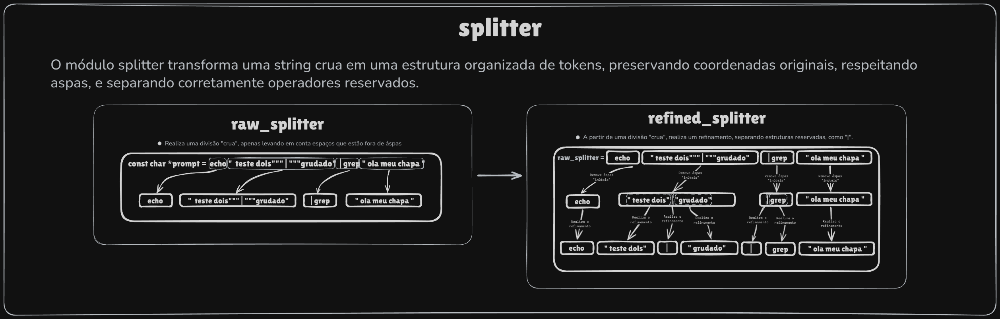

# Splitter Module — Visão Geral

O módulo **splitter** funciona em duas etapas principais:

1. **Raw Split** — separa a linha em tokens básicos, levando em conta aspas e limites.
2. **Refined Split** — percorre cada token bruto, remove aspas inúteis, separa operadores, une partes agrupadas e produz o resultado final.

O módulo retorna sempre um objeto `t_splited_prompt`, pronto para ser usado em qualquer etapa posterior do parser ou executor.

---

## 🔧 Fluxo Geral

1. `ft_splitter`
   Interface pública única. Chama o refinador completo e retorna o resultado final.

2. `ft_refined_splitter`
   - Chama `ft_raw_splitter` para obter os tokens iniciais.
   - Cria um array de listas para armazenar refinamentos.
   - Executa `refine_tokens` para tratar cada token bruto.
   - Copia tudo em um `t_splited_prompt` final.

3. `refine_tokens`
   Itera por todos os tokens brutos e chama `ft_refine_raw_token`.

4. `ft_refine_raw_token`
   Núcleo da lógica de refinamento.
   Remove aspas inúteis, detecta agrupamentos, separa operadores reservados e monta um buffer com o token refinado final ou parcial.

5. Push helpers
   - `ft_refined_token_push`
   - `ft_push_ungrouped_token`
   - `ft_push_grouped_token_part`
   - `ft_push_grouped_token_part_with_skipped_quotes`
   Responsáveis por criar e inserir `t_chunck`s no array de listas conforme a regra do token.

6. `copy_to_matrix`
   Converte toda a estrutura de listas no formato final:
   `t_splited_prompt.chuncks` e `t_splited_prompt.coords`.

---

## 🧱 Estruturas Principais

### `t_splited_prompt`
Representa o resultado final.
Contém:
- `chuncks`: lista de substrings.
- `coords`: coordenadas `{start, end}` de cada token.
- `len`: número total de tokens.
- `destroy`: função que libera toda a estrutura.

É sempre o retorno final do módulo.

---

### `t_refine_raw_token_vars`
Variáveis internas usadas durante o refinamento de um único token bruto.
Armazena índices, controle de aspas e buffer do novo token.
É essencial para o comportamento correto de agrupamento e remoção de aspas.

---

### `t_refined_token_push_params`
Estrutura auxiliar que encapsula todas as informações necessárias para realizar um push de token refinado.
Evita passar dezenas de argumentos entre funções.

---

### `t_chunck`
Representa um token com sua coordenada de origem.
É o bloco fundamental do sistema.

---

## 🧠 Funções-Chave

### `ft_splitter`
Interface final do usuário.
Apenas chama `ft_refined_splitter`.

---

### `ft_refined_splitter`
Coordena todo o processo de split e refinamento.
Une módulos e garante consistência.

---

### `ft_refine_raw_token`
A função mais importante do refinamento.
Executa:
- detecção de aspas,
- remoção de aspas inúteis,
- separação de operadores,
- montagem do novo token,
- divisão em partes agrupadas e push.

---

### `ft_manage_grouped_and_ungrouped_tokens`
Percorre caractere a caractere do token bruto e decide como cada parte deve ser tratada.

---

### `filter_reserved_tokens`
Detecta operadores como `|`, `>`, `>>`, `<`, `<<` e separa corretamente.

---

### `manage_quote_behavior`
Controla a entrada e saída de contexto de aspas.
Importante para não quebrar tokens dentro de strings.

---

### `copy_to_matrix`
Transforma toda a estrutura refinada (listas internas) em um único `t_splited_prompt`, organizado e linear.

---

## ✔ Arquitetura em Resumo

- **Raw Split:** divide.
- **Refined Split:** corrige, limpa e separa operadores.
- **Final:** entrega tokens prontos com coordenadas exatas.

Simples para quem usa.
Robusto por dentro.
