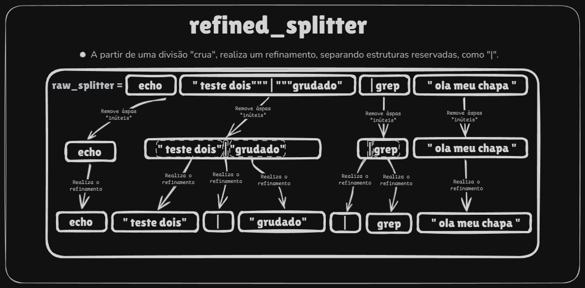

# Refinador de Tokens — Visão Geral

Este módulo implementa o fluxo completo para transformar uma string bruta em uma estrutura organizada de tokens, respeitando aspas, operadores reservados e agrupamentos. O processo ocorre em duas etapas principais:

## 1. **Divisão bruta (`ft_raw_splitter`)**
Primeiro, a entrada é segmentada em tokens iniciais, levando em conta apenas limites simples e aspas básicas.
O resultado é um `t_splited_prompt` com coordenadas indicando onde cada token começa e termina na string original.

## 2. **Refinamento (`ft_refined_splitter`)**
Nesta fase ocorre o trabalho minucioso:
- Análise interna de cada token bruto.
- Tratamento completo de aspas, agrupamentos e operadores.
- Separação precisa de partes internas como `>>`, `<<`, `|`, etc.
- Remoção ou interpretação de aspas redundantes.
- Geração de tokens segmentados de forma lógica e correta.

O refinamento é feito token por token, salvando partes internas em listas temporárias até formar a matriz final.

---

# Estruturas e Funções Principais

Abaixo estão apenas os componentes fundamentais — aqueles que realmente movem o sistema.

---

## **t_refine_raw_token_vars**
Controla o estado interno enquanto um token bruto está sendo refinado.
Armazena índices, buffer temporário, detecção de aspas e início de agrupamentos.

---

## **t_refined_token_push_params**
Usado ao inserir partes refinadas na lista final.
Carrega o token original, a lista final e coordenadas relevantes.

---

## **ft_refined_splitter**
Função principal do refinamento.
Executa todo o pipeline:
1. Divide a entrada bruta (`ft_raw_splitter`);
2. Cria listas para armazenar tokens refinados;
3. Refina cada token (`refine_tokens`);
4. Converte listas em matriz (`copy_to_matrix`);
5. Libera temporários.

É a porta de entrada para o módulo.

---

## **ft_refine_raw_token**
Coração do sistema.
Processa cada token bruto e aplica toda a lógica crítica:
- Cálculo do tamanho real;
- Parser interno de agrupamentos (`ft_manage_grouped_and_ungrouped_tokens`);
- Push final de partes acumuladas.

---

## **ft_manage_grouped_and_ungrouped_tokens**
Loop principal que percorre o token caractere por caractere.
Regras centrais:
- Aspas: delegadas a `manage_quote_behavior`;
- Operadores reservados: `filter_reserved_tokens`;
- Texto comum: enviado ao buffer final.

Aqui está a mecânica real que define a qualidade do split.

---

## **manage_quote_behavior**
Lida com abertura/fechamento de aspas, pulando aspas inúteis e definindo o início dos grupos.
É o componente mais delicado — controla como `"abc""def"` vira tokens corretos.

---

## **filter_reserved_tokens**
Detecta operadores (|, >>, <<, >, <).
Empurra trechos anteriores, cria um chunk para o operador e avança o índice.
Só atua fora de aspas.

---

## **copy_to_matrix**
Converte listas temporárias em um `t_splited_prompt` final e pronto para uso.

---

# Conclusão

O módulo se baseia em três pilares:
1. **Coordenadas precisas do raw split**,
2. **Parser sólido de aspas e operadores**,
3. **Conversão limpa para uma matriz final de tokens**.

O código é modular, seguro e preparado para lidar com todos os casos de parsing típicos de um shell.
