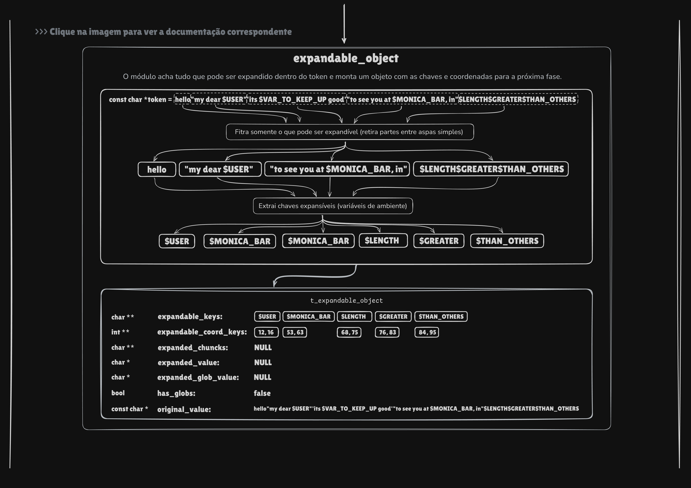
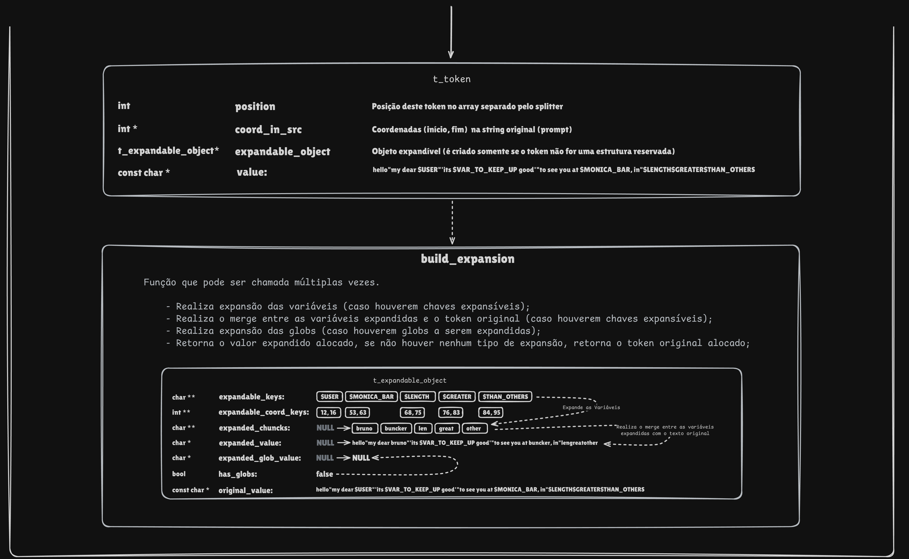

# 🧩 Submodulo: Tokenizer — Visão Geral

Este módulo implementa o núcleo da **fase de expansão** do shell.
Ele identifica tokens, classifica operadores, expande variáveis,
expande globs, remove aspas e produz o valor final pronto para uso.

---

# 🔧 Estruturas Principais

## t_token_type
Enum que representa o tipo de token.
Operadores de 1 char usam 1 byte.
Operadores de 2 chars usam 2 bytes combinados.
Permite comparar diretamente como inteiros.

## t_token
Estrutura central do módulo.
Contém:
- valor original do token
- tipo (`t_token_type`)
- coordenadas
- ponteiro para último valor expandido
- callbacks de expansão (`expand_var`, `expand_glob`)
- ponteiro para `expandable_object`
- função `destroy`

É o “objeto” completo de um token expansível.

## expandable_object
Guarda tudo necessário para reconstruir o token expandido:
- string original
- lista de coordenadas de variáveis
- lista de partes fixas
- buffer final

Ele existe apenas para tokens `UNKNOWN`, pois só eles podem conter variáveis
e globs. É a base da lógica de expansão.

---

# 🔨 Funções Importantes

## ft_tokenize
Recebe uma string e produz um token.
Identifica operadores, cria `t_token`, define callbacks,
e aloca `expandable_object` quando necessário.

## ft_create_token
Cria e inicializa um token individual.
Define tipo, posição, ponteiros internos e callbacks.
Tokens `UNKNOWN` recebem um `expandable_object`.

## ft_get_token_type
Detecta:
- operadores de 1 caractere (`|`, `>`, `<`, `&`, etc.)
- operadores de 2 caracteres (`>>`, `<<`, `||`, `>|`, etc.)
- caso contrário: `TOKEN_UNKNOWN`

Pilar fundamental do parser.

---

# 🚀 Expansão

## ft_build_expansion
Função principal da expansão.

Fluxo:
1. Se já foi expandido antes → retorna cópia.
2. Se token não é expansível → retorna original.
3. Caso contrário:
   - `ft_build_chuncks()` → expande variáveis
   - `ft_merge_expansion()` → monta string final
   - `ft_expand_globs()` → executa glob
   - `ft_remove_quotes()` → remove aspas externas
4. Armazena resultado em `last_build`.

É o “motor” da expansão POSIX.

---

## ft_build_chuncks
Varre o token original e identifica cada `$VAR`.
Para cada uma:
- chama `expand_var()`
- salva as partes fixas
- guarda coordenadas

Prepara tudo para a fase de merge.

---

## ft_merge_expansion
Reconstrói o token substituindo as variáveis expandidas.
Percorre a string original copiando apenas os trechos
entre `$VAR`, inserindo as expansões quando necessário.

Implementa manualmente:
"Olá $USER" → "Olá bruno".

---

## ft_expand_globs
Se o token contém `*`, `?` ou `[]`, chama `expand_glob()`.
A função converte a matriz de resultados em uma única string
e salva em `expanded_glob_value`.

Ex: `*.c` → `"main.c utils.c foo.c"`.

---

## ft_remove_quotes
Reconstrói o token removendo aspas externas.
Aceita aspas simples e duplas.
Último passo da expansão.

Exemplos:
"foo bar" → foo bar
'$USER'   → $USER

---

# 🧱 Resumo Rápido

Este módulo:
1. identifica e cria tokens,
2. expande variáveis,
3. expande globs,
4. remove aspas,
5. guarda cache para não recalcular.

É o núcleo real da fase de expansão do shell.
